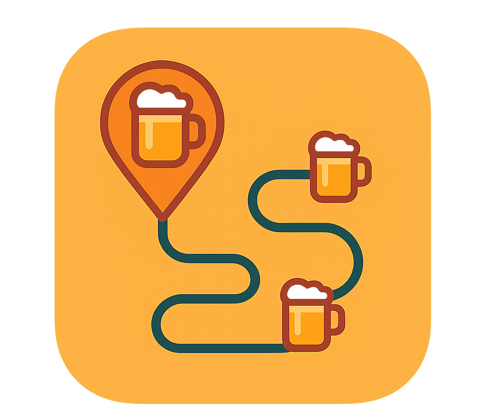
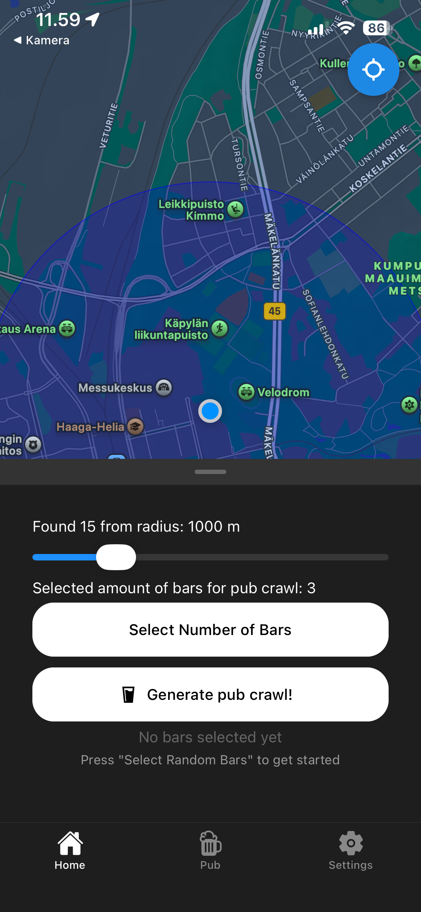
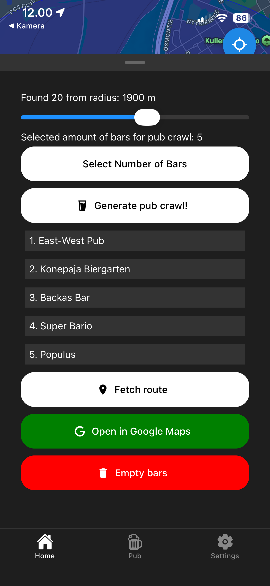
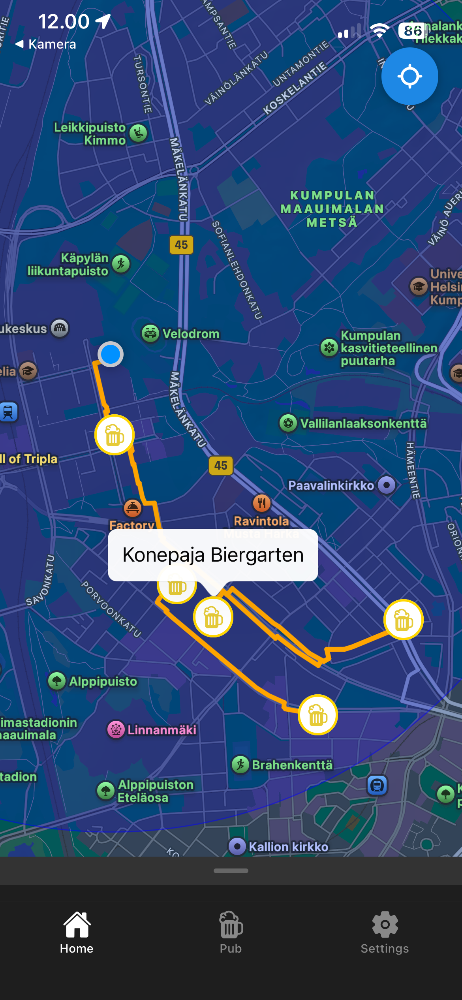
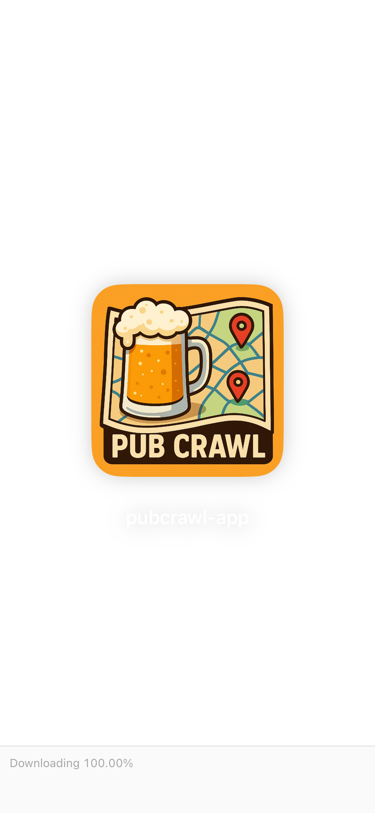

# Pubcrawl app
## Gather your friends, use your location and select amount of bars you and your friends want to crawl.
### This app was inspired by [Kallion kapakkageneraattori](https://kallioon.fi/)
### Idea of the app:

App uses your current location and uses a radius of minumum 500 meters to maximum of 3 kilometers to fetch bars and pubs inside that radius. You can then select the amount of bars from 3 to 10 to be selected randomly from found bars inside the radius. Now you can generate a pub crawl!

After this you can press fetch route, which generates route from your location to first bar, then to second etc. You can view the bars in the map with a custom beer marker!

You can also select to open route in Google maps to view Public Transportation to the bars! 

## Used technologies:
### APIs:
[Geoapify Places API](https://www.geoapify.com/places-api/) This is used to fetch the bars and pubs.
[Geoapify Routing API](https://www.geoapify.com/routing-api/) This is used for generating the route from bars to other one.
### Libraries:
[Gorhom Bottomsheet](https://gorhom.dev/react-native-bottom-sheet/) Used to create the bottomsheet to get Google Maps like UI
[React Native Paper](https://reactnativepaper.com/) Used for buttons to get united UI 
[React native community Slider](https://www.npmjs.com/package/@react-native-community/slider) Used for setting the radius in the map. React Native Paper did not have slider, so went with this. Not the best but oh well.
[React Native Picker](https://www.npmjs.com/package/@react-native-picker/picker) Used for setting amount of bars, dont like it. Doesnt work in android and looks very bad.
[React Native Async storage](https://www.npmjs.com/package/@react-native-async-storage/async-storage) Used for setting and saving dark mode.
[Shopify Flash list](https://shopify.github.io/flash-list/) Used for listing the bars, same as flat list but better
### Navigation:
[React Native bottomtabs](https://reactnavigation.org/docs/bottom-tab-navigator/) used for basic bottom tab navigation.

